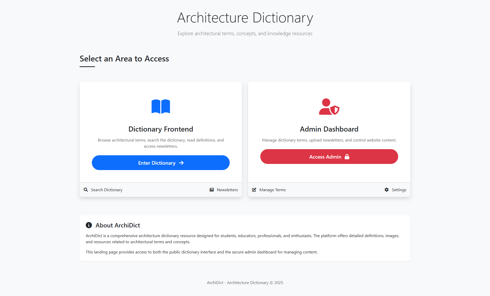
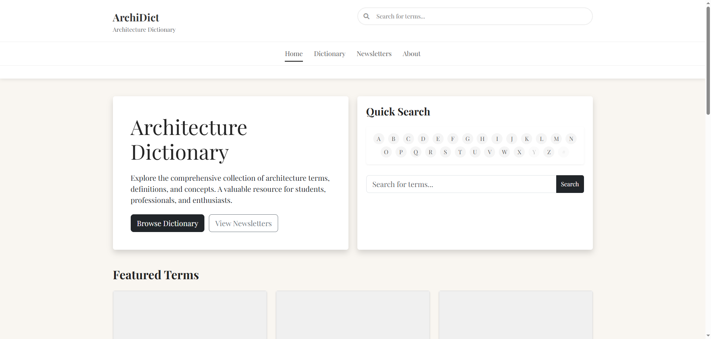
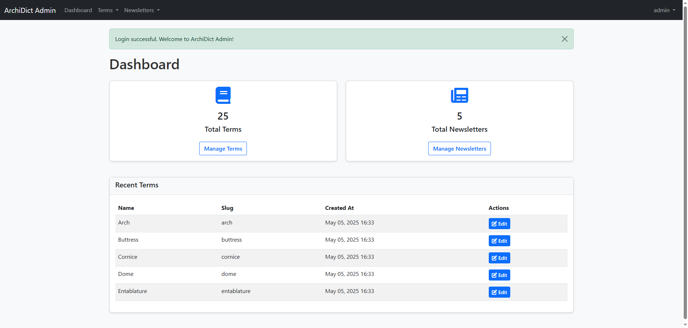

# ArchiDict - Architecture Dictionary Platform

ArchiDict is a comprehensive architecture dictionary platform designed to serve as a valuable educational resource for students, professionals, and enthusiasts in the field of architecture. The platform offers detailed definitions, images, and resources related to architectural terms and concepts.

## Table of Contents
- [Overview](#overview)
- [Features](#features)
- [Technology Stack](#technology-stack)
- [Installation](#installation)
- [Usage Guide](#usage-guide)
- [Code Structure](#code-structure)
- [Code Delivery Report](#code-delivery-report)
- [Admin Access](#admin-access)

## Overview

ArchiDict (Architecture Dictionary) is a web-based platform that provides a comprehensive collection of architecture terms, definitions, and concepts. The application consists of a public frontend for users to browse and search the dictionary and a secure admin dashboard for managing content.

### Mission Statement
To create a comprehensive architecture dictionary that serves as a valuable educational resource for students, professionals, and enthusiasts in the field of architecture.

## Features

### Frontend Features
1. **Interactive Dictionary**:
   - Browse architecture terms in a book-like interface using Turn.js
   - Filter terms by their first letter
   - Search functionality to find specific terms
   - Cross-references to related terms

2. **Detailed Term Views**:
   - Comprehensive definitions
   - High-quality illustrative images
   - Related terms linking

3. **Newsletters**:
   - Access to architectural newsletters published by the platform
   - Downloadable PDF format

4. **About Section**:
   - Information about the platform's mission
   - Team information
   - Contact details

### Admin Features
1. **Authentication**:
   - Secure login system
   - User profile management

2. **Content Management**:
   - Add, edit, and delete architecture terms
   - Upload and manage term images
   - Establish relationships between related terms
   - Manage newsletters

3. **Dashboard**:
   - Overview of term counts and recent additions
   - Quick access to management functions

## Technology Stack

### Backend
- **PHP**: Core programming language (compatible with PHP 7.x and above)
- **MySQL**: Database management system
- **PDO**: Database abstraction layer for secure database operations

### Frontend
- **HTML5**: Markup language
- **CSS3**: Styling
- **JavaScript**: Client-side scripting
- **jQuery**: JavaScript library used for DOM manipulation
- **Turn.js**: Library used for the book-like dictionary interface

### Frameworks and Libraries
- **Bootstrap 5.3.0**: Frontend framework for responsive design
- **Font Awesome 6.0.0**: Icon library
- **TinyMCE**: Rich text editor for admin content management

## Installation

### Prerequisites
- Web server (Apache, Nginx, etc.)
- PHP 7.0 or higher with the following extensions:
  - PDO
  - PDO_MySQL
  - GD (for image processing)
  - Fileinfo
- MySQL 5.7 or higher

### Setup Instructions
1. **Clone or download the repository**:
   Place the code in your web server's document root directory.

2. **Database configuration**:
   - Create a MySQL database named `archidict`
   - Update database credentials in the following files if necessary:
     - `/includes/config.php`
     - `/frontend/includes/config.php`
     - `/admin/includes/config.php`

3. **Database setup**:
   - Method 1: Run the setup script by visiting `http://your-domain/archidict/setup_db.php`
   - Method 2: Manually import the SQL files:
     - Import `base_database.sql` first to create the database structure
     - Then import `dummy_data.sql` if you want to populate it with sample terms

4. **Directory permissions**:
   Ensure that the following directories are writable by the web server:
   - `/uploads/`
   - `/uploads/terms/`
   - `/uploads/newsletters/`

5. **Check system compatibility**:
   Visit `http://your-domain/archidict/phpinfo_check.php` to verify that your server meets all requirements.

6. **URL configuration**:
   Update the `SITE_URL`, `FRONTEND_URL`, and `ADMIN_URL` constants in all config files if your installation is not at the webroot.

## Usage Guide

### Frontend 


*ArchiDict Home*


*ArchiDict Dictionary Interface*

1. **Home Page**:
   - The landing page (`/index.php`) provides access to both the frontend dictionary and admin dashboard.
   - Click "Enter Dictionary" to access the frontend.

2. **Dictionary**:
   - The main dictionary view (`/frontend/dictionary.php`) displays terms in a book-like interface.
   - Use the alphabet navigation at the top to filter terms by first letter.
   - Click and drag page corners to flip through the dictionary like a real book.
   - Use the control buttons to navigate between pages.

3. **Term Details**:
   - Click on any term to view its complete definition (`/frontend/term.php?slug=term-slug`).
   - Related terms are linked for easy reference.

4. **Search**:
   - Use the search box in the header to find specific terms.
   - The search results page shows matching terms and their brief definitions.

5. **Newsletters**:
   - Access architectural newsletters from the Newsletters page (`/frontend/newsletters.php`).
   - Download newsletters in PDF format.

### Admin Panel



1. **Login**:
   - Access the admin dashboard at `/admin/index.php`.
   - Default credentials: 
     - Username: `admin`
     - Password: `Admin123!`

2. **Dashboard**:
   - View summary of contents and recent activity.

3. **Managing Terms**:
   - Add new terms via `/admin/terms/add.php`.
   - Edit existing terms via `/admin/terms/edit.php?id=X`.
   - Delete terms from the terms listing page.
   - Establish relationships between terms.

4. **Managing Newsletters**:
   - Add, edit, and delete newsletters from the newsletters section.
   - Upload PDF files for newsletter content.

## Code Structure

```
/archidict/
│
├── admin/                  # Admin dashboard
│   ├── css/                # Admin-specific styles
│   ├── includes/           # Admin PHP classes and templates
│   ├── js/                 # Admin JavaScript files
│   ├── newsletters/        # Newsletter management
│   ├── terms/              # Term management
│   ├── index.php           # Admin dashboard home
│   ├── login.php           # Authentication
│   └── logout.php          # Session termination
│
├── css/                    # Global CSS files
│
├── frontend/               # Public frontend
│   ├── css/                # Frontend-specific styles
│   ├── includes/           # Frontend PHP classes
│   ├── js/                 # Frontend JavaScript files
│   ├── about.php           # About page
│   ├── dictionary.php      # Interactive dictionary
│   ├── index.php           # Frontend home
│   ├── newsletters.php     # Newsletter listing
│   ├── search.php          # Search functionality
│   └── term.php            # Individual term view
│
├── includes/               # Global includes
│
├── uploads/                # File uploads
│   ├── newsletters/        # Newsletter PDFs
│   └── terms/              # Term images
│
├── base_database.sql       # Database structure
├── dummy_data.sql          # Sample data
├── index.php               # Main landing page
├── setup_db.php            # Database setup script
└── phpinfo_check.php       # Server compatibility check
```

### Key Classes

- **Database**: Handles database connections using PDO
- **Term**: Manages architecture term data and relationships
- **Newsletter**: Handles newsletter data and file management
- **Utils**: Contains utility functions
- **Auth**: Manages admin authentication

## Code Delivery Report

### Completed Components

1. **Database Structure**:
   - Users table for admin authentication
   - Terms table for storing architectural terms
   - Term_relationships table for linking related terms
   - Newsletters table for architectural resources

2. **Frontend Features**:
   - Interactive dictionary with Turn.js integration
   - Term browsing by alphabet
   - Search functionality
   - Term relationships
   - Newsletter access
   - About page with information

3. **Admin Features**:
   - Secure authentication system
   - Term management (CRUD operations)
   - Term relationship management
   - Newsletter management
   - User profile management

4. **Support Files**:
   - Database setup scripts
   - Sample data
   - Server compatibility checking

### Code Quality

- **Security Features**:
  - Parameterized SQL queries via PDO
  - Password hashing (bcrypt)
  - Input sanitization
  - Session security measures

- **Responsive Design**:
  - Bootstrap-based responsive layout
  - Mobile-friendly interface

- **Maintainable Code Structure**:
  - Object-oriented approach
  - Consistent file organization
  - Separated frontend and admin sections

## Admin Access

Default admin credentials:
- **Username**: admin
- **Password**: Admin123!

It is strongly recommended to change these credentials after initial login for security purposes.

---

© ArchiDict - Architecture Dictionary
